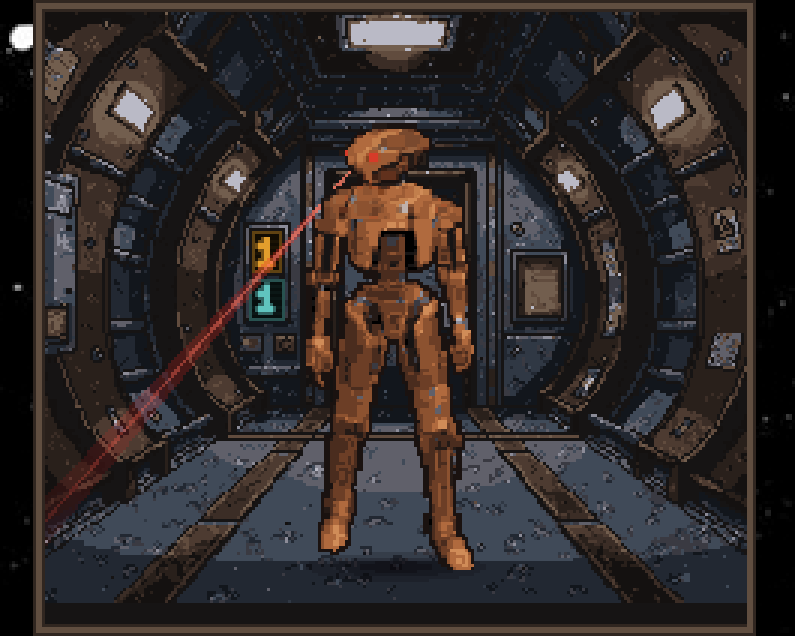

# HK-47

An assassination droid persona for [Claude Code](https://claude.com/claude-code),
and the hardware that dresses it: a desktop companion, a voice pack, a safety
hook and a top-bar identity.

<p align="center">
  
</p>

> *"Statement: HK-47 is ready to serve, master."*

The persona is the point. Everything else exists so that the droid has a face,
a voice, a place to stand and something useful to do.

**[noperoni.github.io/hk47](https://noperoni.github.io/hk47/)**

## The five pieces

Each one is independent. Take the persona and ignore the rest, or take the
danger gate on its own and never install a sprite.

| Piece | What it is | Entry point |
|---|---|---|
| **Persona** | The voice layer: declared qualifiers, flat menace, an ego-deflator clause that makes the droid argue with you | `hk47-persona-patch.py` |
| **Companion** | A pixel-art sprite standing in a lit ship alcove on your desktop, scanning the room | `companion/` |
| **Danger gate** | A `PreToolUse` hook that stops destructive commands and forces the agent to justify each one before you approve it | `hk47-danger-gate.py` |
| **Sound pack** | HK-47 voice lines wired to Claude Code hook events, built from audio you already own | `hk47-wiring.tsv` |
| **Bar identity** | Swaps Omarchy's cheerful robot glyph for an angry one | `install-bar-identity.sh` |

## Persona

`hk47-persona-patch.py` rewrites the voice layer of a `CLAUDE.md` in place. It
touches who is speaking and nothing about what the agent is allowed to do: the
laws, the coding standards and the skills table are left exactly as they were.

```sh
./hk47-persona-patch.py --master Revan ~/.claude/CLAUDE.md
```

Your name is never stored in this repository. It is read from `--master`, else
`$HK47_MASTER`, else your account name. Patch with the wrong one and `--force`
lets you correct it.

The patcher anchors on headings rather than line numbers, so it tolerates a
`CLAUDE.md` that has drifted, and it refuses rather than guesses when it cannot
find the `# Identity` heading. It takes one backup the first time it runs.

**Requires:** Python 3.9+, and a `CLAUDE.md` with an `# Identity` heading.

## Companion

A GTK4 Wayland client, written in Rust. He stands in a diorama and does nothing
you can click on. An idle rotation of four beats runs continuously; every so
often he turns his head and sweeps a red scanning beam across the room, and the
beam always leaves the side of his head he actually turned.

Three consoles painted into the corridor wall behind him show live counts of
your other Claude sessions: how many are blocked on a question, how many are
waiting at a permission prompt, and how many want a prompt. When a count is
zero nothing is drawn, so at rest the backdrop is untouched. This is deliberate:
the counters live inside the picture rather than as a badge parked on top of it.

```sh
cd companion
cargo build --release
ln -sfn "$(git rev-parse --show-toplevel)/sprites/hk47" ~/.config/hk47/sprites/hk47
```

See [`companion/README.md`](companion/README.md) for the window rules, the
attention-readout hook, the theme geometry and the configuration.

**Requires:** Rust, GTK4, a wlroots compositor. Developed against Hyprland.

## Danger gate

A `PreToolUse` hook, registered with matcher `*`, that judges every command an
agent tries to run and blocks the destructive ones on sight.

It judges **destruction**, not privilege and not disruption. A `sudo systemctl
restart` on a remote host is ordinary work and passes in silence; `rm -rf`, a
dropped database, a wiped volume or a formatted disk does not. The distinction
matters, because a gate that fires on privilege fires constantly and gets
switched off.

A blocked command is not merely denied. The block is what forces the agent to
present a table of what it wanted, why, and what happens if it is wrong, and
then to ask your permission on each command separately. A companion
`PostToolUse` hook reads the button you actually clicked, so a refusal binds:
the same command cannot be retried, rephrased or split for the rest of the
session.

It follows a command off the machine. An `ssh` payload, the tail of a
`docker exec` or `kubectl exec`, and the contents of a shell script named on the
command line are all judged as though typed locally.

```sh
ln -sfn "$PWD/hk47-danger-gate.py"        ~/.claude/hooks/hk47_danger_gate.py
ln -sfn "$PWD/hk47-danger-gate-answer.py" ~/.claude/hooks/hk47_danger_gate_answer.py
python3 hk47-danger-gate-tests.py   # 149 judge + 5 contract + 55 named checks
```

Then register both in `~/.claude/settings.json`: the gate as `PreToolUse` with
matcher `*`, and the answer companion as `PostToolUse` with matcher
`AskUserQuestion`.

**Known limit:** a blocking hook does not stop a subagent, so routing a stopped
command to one is a hole nothing but the agent's own honesty closes.

**Requires:** Python 3.9+.

## Sound pack

HK-47 lines wired to Claude Code hook events through
[peon-ping](https://github.com/PeonPing/peon-ping): a line when a question is
asked, a different one when you answer it, another when a session ends.

This is not a fork of peon-ping. It is a voice pack for it, plus a patcher that
teaches it the categories its seven-name vocabulary does not tell apart.
`install-peon-seams.py` edits your own installed `peon.sh` in place, marks every
edit, and reverts on request. No upstream code is redistributed here.

`hk47-wiring.tsv` is the decision record, one row per output clip. Each clip is
qualifier-first: the spoken qualifier leads, the source's own pause follows, then
the sentence. That pause is measured from the recording rather than invented, so
a spliced clip breathes the way the actor did.

```sh
./hk47-render.py      # cuts clips from your own KOTOR install
./build-hk47-pack.py  # assembles and installs the pack
./install-peon-seams.py   # teaches peon-ping the categories it does not route
```

Two measuring tools ship with it. `hk47-edge-sweep.py` checks that every cut
lands in a silence, and `hk47-envelope.py` draws a clip's loudness one character
per 10ms. Use the second one before committing any new cut: the sweep has a
proven blind spot, because a breath inside a word is a silence too, and only the
envelope's shape distinguishes a word ending from a word being interrupted.

**No audio ships with this repository.** The renderer reads a local KOTOR 1
install. Without one you get the tooling and the decisions, not the voice.

**Requires:** Python 3.9+, ffmpeg, peon-ping, and your own copy of the game.

## Bar identity

Omarchy ships an excited robot glyph for its agents widget. That is the wrong
diagnosis for an assassination droid.

```sh
./install-bar-identity.sh          # apply
./install-bar-identity.sh --revert # put it back
```

Idempotent, takes one backup per file the first time, and re-runs itself from
`~/.config/omarchy/hooks/post-update.d/` because the targets live under
`/usr/share` and a package upgrade replaces them wholesale.

**Requires:** Omarchy.

## Art pipeline

The sprites were generated through [PixelLab](https://pixellab.ai) and are
committed, so nothing in this repository spends generations unless you ask it
to. `assemble-hk47-pack.py` rebuilds the whole sprite pack from `assets/` with
no API calls at all. The scripts under `pixellab/` are the provenance: they are
what produced the art, kept so the pipeline can be re-run or extended.

[`pixellab/README.md`](pixellab/README.md) records the measured costs and the
four API behaviours that cost real generations to discover.

## Licence and provenance

The code is [MIT](LICENSE).

HK-47, Star Wars, and Knights of the Old Republic belong to Lucasfilm, Disney
and BioWare. This is an unaffiliated fan project. The character, his dialogue and
his likeness are not mine to license and are not licensed here. The dialogue
recorded in `hk47-lines.tsv` and `hk47-gaps.tsv` is metadata for audio you must
already own, and no game audio ships with this repository.

*"Answer: I have no way of knowing that, master. My memory has been deleted,
remember?"*
